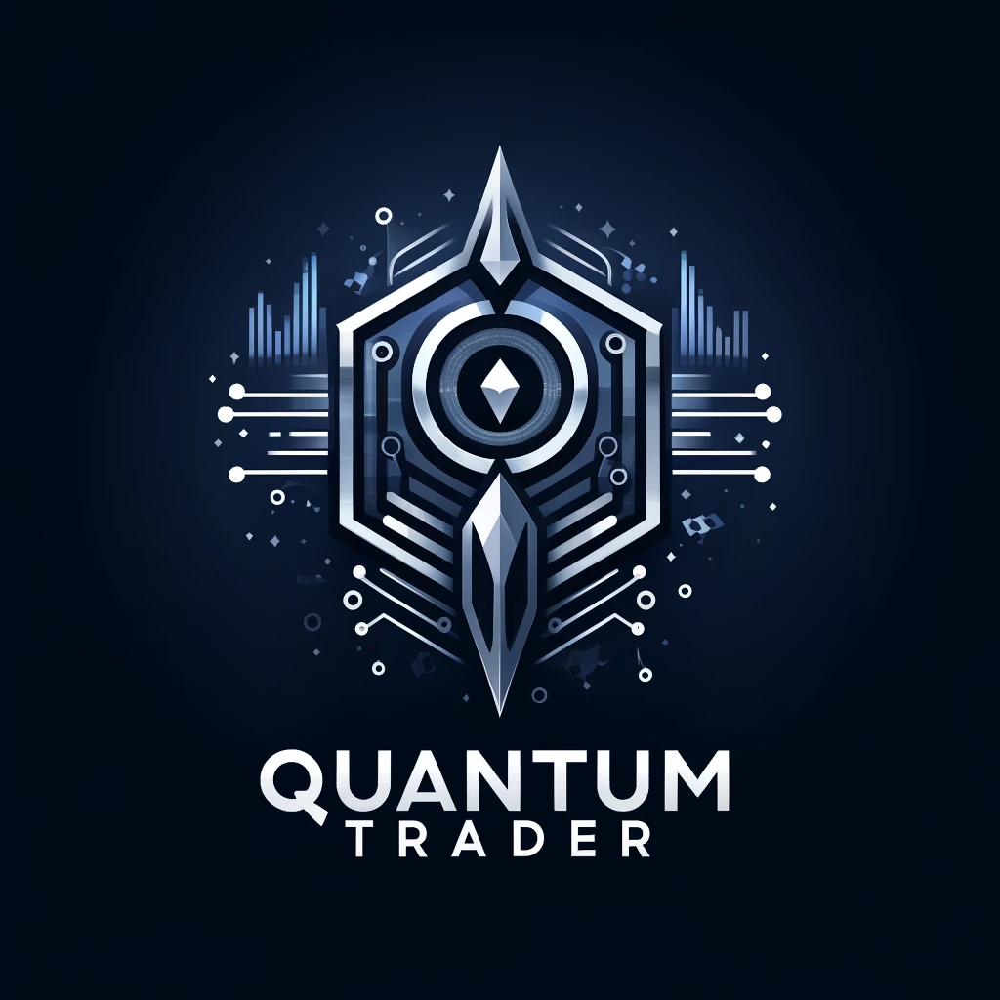

# QuantumTrader

Welcome to QuantumTrader - Your Gateway to the Future of Cryptocurrency Trading!

## Introduction

Welcome to QuantumTrader - Your Gateway to the Future of Cryptocurrency Trading!

QuantumTrader is designed to be at the forefront of trading innovation, combining advanced AI algorithms with quantum-inspired computational techniques to revolutionize cryptocurrency trading. Our platform equips investors with the tools to navigate the complexities of the digital asset market, enhancing precision and confidence in their trading strategies.

Understanding the volatile nature of the cryptocurrency market, QuantumTrader aims to mitigate risks while capitalizing on investment opportunities. Our technology is accessible to both seasoned traders and newcomers, democratizing advanced trading tools to empower all users to achieve their investment goals.

Join us on a journey to the future of trading, where innovation meets unparalleled potential.

## Features

QuantumTrader offers a comprehensive suite of features to enhance your cryptocurrency trading experience:

- **AI-Powered Trading Algorithms**: Utilizing advanced AI, QuantumTrader's algorithms analyze market data to predict trends and execute trades, aiming for a 15% daily profit target.

- **Quantum-Inspired Algorithms**: Leveraging quantum-inspired algorithms on classical computers, we simulate the advantages of quantum computing for improved optimization and processing speed in trading strategies.

- **Advanced Predictive Analytics**: With our analytics tools, anticipate market movements using a combination of machine learning and real-time data analysis.

- **Real-Time Market Data and Insights**: Stay informed with immediate access to market data and insights, helping you make swift and informed decisions.

- **Customizable Trading Strategies**: QuantumTrader supports various trading styles and risk tolerances, allowing for tailored strategies that align with your investment objectives.

- **High-Level Security**: Your security and privacy are paramount. Our platform uses advanced encryption and secure data handling practices to protect your information and assets.

- **User-Friendly Interface**: Our platform's intuitive design ensures a seamless trading experience, regardless of your experience level.

## Technical Specifications and Requirements

To get the most out of QuantumTrader, ensure your system meets the following criteria:

- **Operating System**: Windows 10/11, macOS 10.15+, or modern Linux distributions (Ubuntu 20.04+, CentOS 8+, etc.).
- **Python Version**: 3.8 or higher, with pip installed. QuantumTrader is built with Python for cross-platform support.
- **Dependencies**: Libraries such as numpy, pandas, scikit-learn, tensorflow/keras, and PyQt5 are essential. A requirements.txt file is provided for convenience.
- **Hardware**: A quad-core processor and 8 GB RAM are recommended. A dedicated GPU is beneficial for intensive model training.
- **API Access**: API keys from supported exchanges are required for real-time data and trading.

### Accessing Quantum-Inspired Algorithms

For those exploring quantum-inspired algorithms, Python's machine learning libraries offer a gateway to simulate quantum computing advantages. Additionally, cloud-based platforms like IBM Qiskit and Microsoft Azure Quantum provide access to quantum computing resources and communities for further experimentation.

## Disclaimer and Risk Warning

Investing in cryptocurrencies involves a high risk of loss and may not be suitable for all investors. The high degree of leverage can work against you as well as for you. Before deciding to invest in cryptocurrencies, you should carefully consider your investment objectives, level of experience, and risk appetite.

Please Note: The performance of this program is not guaranteed. While QuantumTrader aims to enhance your trading capabilities, there is no assurance of generating a profit, and it is possible to lose all your invested capital. This program is not a financial prediction tool but a technological aid designed to assist in your trading decisions. Engage with cryptocurrency trading at your own risk, and consider seeking advice from an independent financial advisor if you have any doubts.

## Join the Future of Trading Today!

Embrace the future of cryptocurrency trading with QuantumTrader. Our platform offers a unique combination of advanced technologies and user-centric design to empower your trading journey. Whether you're an experienced trader or new to the market, QuantumTrader is your partner in pursuit of trading excellence.
